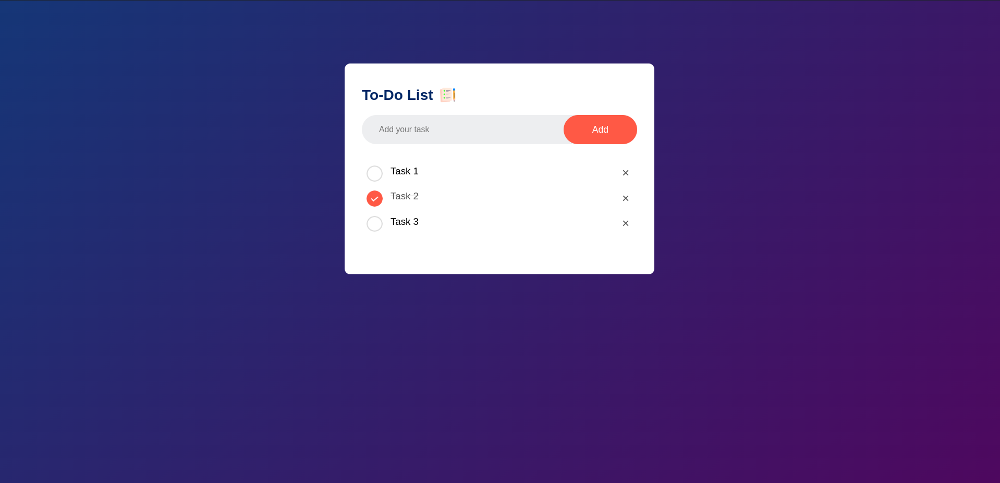

# To Do App
- A To do application that does the following functions

  1. create a new task
  2. check the task if complete
  3. uncheck the task if not
  4. saves the data in browser
  5. remove tasks
----
# Screenshot

---
- This is project is a referonce from this [video](https://www.youtube.com/watch?v=G0jO8kUrg-I)